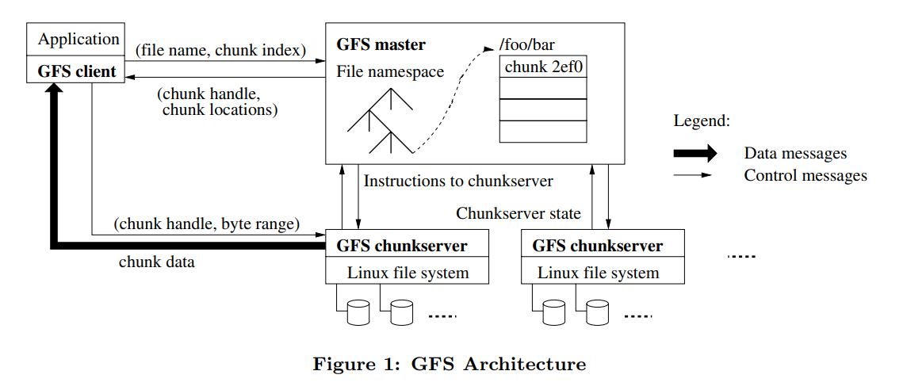

# GFS论文阅读记录
GFS论文链接：https://pdos.csail.mit.edu/6.824/papers/gfs.pdf

GFS论文中文翻译：https://blog.mrcroxx.com/posts/paper-reading/gfs-sosp2003/

## 1. 简介
GFS与传统的分布式文件系统有着很多相同的设计目标，比如，性能、可伸缩性、可靠性以及可用性。但是，其设计还基于Google对自己的应用的负载情况和技术环境的观察的影响，因此GFS和早期文件系统的假设都有明显的不同，也衍生出了完全不同的设计思路。主要有如下几点：
1. 组件失效是正常的。GFS由上千台机器组成，可能每时每刻都会有机器失效，因此，持续的监控、错误侦测、灾难冗余以及自动恢复的机制必须集成在GFS中。
2. GFS存储的文件非常大，是GB甚至TB类型的，因此需要特殊的参数调优
3. 大部分的文件写操作，都是append，append比随机的overwrite更常见，因此GFS针对append操作进行了优化
4. 向应用提供类似文件系统API。我们放松了对GFS一致性模型的要求，这样就减轻了文件系统对应用程序的苛刻要求，大大简化了GFS的设计。我们引入了原子性的记录追加（append）操作，从而保证多个客户端能够同时进行追加操作，不需要额外的同步操作来保证数据的一致性。

## 2. 设计概览
### 2.1 假设
- 系统由许多廉价的普通组件组成，组件失效是一种常态。系统必须持续监控自身的状态，它必须将组件失效作为一种常态，能够迅速地侦测、冗余并恢复失效的组件。
- 系统会存储许多大文件（100MB~xGB），这些大文件需要被有效组织起来。同时系统也支持存储小文件，但不会对小文件做优化。
- 系统工作负载主要由两种读操作组成：大规模流式读取和小规模随机读取。
- 系统的工作负载还包括许多大规模的、顺序的、数据追加方式的写操作。一般情况下，每次写入的数据的大小和大规模读类似。数据一旦被写入后，文件就很少会被修改了。系统支持小规模的随机位置写入操作，但是可能效率不彰。
- 系统必须高效的、行为定义明确的实现多客户端并行追加数据到同一个文件里的语意。使用最小的同步开销来实现的原子的多路追加数据操作是必不可少的。文件可以在稍后读取，或者是消费者在追加的操作的同时读取文件。
- 高性能的稳定网络带宽远比低延迟重要。
### 2.2 接口
create delete open close read write

snapshot

record append：允许多个客户端同时对一个文件进行数据追加操作，同时保证每个客户端的追加操作都是原子性的
### 2.3 架构

如图所示，GFS采用的是单Master、多个ChunkServer的架构，并且可以给多个Client提供服务。

文件被分割为固定大小的chunk，每个chunk都有一个全球唯一的标识符chunk handle，chunk handle是由master在创建chunk时分配的。ChunkServer会将chunk以Linux文件的格式存在本地磁盘上。为了提高可用性，每一个chunk会被复制到多台ChunServer（默认为3台）。

master存储了文件系统所有的元数据：命名空间，访问控制信息，从文件到chunk的映射信息，chunk的当前存储位置等。chunk的租约管理、chunk在chunkserver之间的迁移也由master管理。

client与master、chunkserver交互，从而读写文件。client会和master交互获取元信息，但是所有文件数据交互的通信都是直接与chunkserver进行的。

client和chunkserver都不会缓存文件数据，但client会缓存元数据。client不缓存文件数据是因为缓存文件数据不会有性能提升（应用对大文件的处理一般是流式处理、或无法缓存下那么大的文件）；chunkserver不缓存文件数据是因为chunk被chunkserver保存在本地磁盘，Linux会将经常访问的数据缓存在内存中。

### 2.4 单一Master
单一的Master节点的策略大大简化了我们的设计。单一的Master节点可以通过全局的信息精确定位Chunk的位置以及进行复制决策。另外，我们必须减少对Master节点的读写，避免Master节点成为系统的瓶颈。

具体来说，client不会通过master去读写file，而是询问master应该与哪些chunkserver交互，然后把这些信息缓存，并且直接与chunkserver交互完成文件读写。
### 2.5 Chunk尺寸
chunk大小是关键的设计参数之一：64MB。

较大的chunk尺寸主要由以下的优点：
- 减少client与master通信的次数
- 采用较大的chunk尺寸，client可以对一个chunk进行多次操作，这样就可以通过和chunkserver保持较长时间的TPC连接来减少网络负载
- 减少了master节点需要保存的元数据的数量，这样允许我们把元数据都放在内存中（会带来额外好处）
  
缺点：

  小文件包含较少的Chunk，甚至只有一个Chunk。当有许多的客户端对同一个小文件进行同时访问时，存储这些Chunk的Chunk服务器就会变成热点。
### 2.6 元数据
master主要存放三种类型的元数据：

- file和chunk的命名空间
- 从文件到chunk的映射
- 从chunk到存放chunk副本的chunkserver的映射

所有的元数据都保存在内存中。前两种类型的元数据（命名空间、文件和Chunk的对应关系）同时也会以记录变更日志的方式记录在操作系统的系统日志文件中，日志文件存储在本地磁盘上，同时日志会被复制到其它的远程服务器上。
#### 2.6.1 内存中的数据结构
因为元数据保存在内存中，所以Master服务器的操作速度非常快。

  并且，Master服务器可以在后台简单而高效的周期性扫描自己保存的全部状态信息。

  Chunk的数量以及整个系统的承载能力都受限于Master服务器所拥有的内存大小。

#### 2.6.2 chunk位置信息
  Master服务器并不持久化保存哪个Chunk服务器存有指定Chunk的副本的信息。

  Master服务器只是在启动的时候轮询Chunk服务器以获取这些信息。

  #### 2.6.3 操作日志
  操作日志包含了关键的元数据变更历史记录。

  这对GFS非常重要。这不仅仅是因为操作日志是元数据唯一的持久化存储记录，它也作为判断同步操作顺序的逻辑时间基线（注：也就是通过逻辑日志的序号作为操作发生的逻辑时间，类似于事务系统中的LSN）。

  文件和Chunk，连同它们的版本(参考4.5节)，都由它们创建的逻辑时间唯一的、永久的标识。

  操作日志非常重要，我们必须确保日志文件的完整，确保只有在元数据的变化被持久化后，日志才对客户端是可见的。否则，即使Chunk本身没有出现任何问题，我们仍有可能丢失整个文件系统，或者丢失客户端最近的操作。所以，我们会把日志复制到多台远程机器，并且只有把相应的日志记录写入到本地以及远程机器的硬盘后，才会响应客户端的操作请求。

  Master服务器会收集多个日志记录后批量处理，以减少写入磁盘和复制对系统整体性能的影响。

  Master服务器在灾难恢复时，通过重演操作日志把文件系统恢复到最近的状态。

  为了缩短Master启动的时间，我们必须使日志足够小（注：即重演系统操作的日志量尽量的少）。Master服务器在日志增长到一定量时对系统状态做一次Checkpoint(注：Checkpoint是一种行为，一种对数据库状态作一次快照的行为)，将所有的状态数据写入一个Checkpoint文件（注：并删除之前的日志文件）。

## 3. master节点
假设我们有上百个客户端和一个Master节点。尽管实际中可以拿多台机器作为Master节点，但是GFS中Master是Active-Standby模式，所以只有一个Master节点在工作。Master节点保存了文件名和存储位置的对应关系。除此之外，还有大量的Chunk服务器，可能会有数百个，每一个Chunk服务器上都有1-2块磁盘。

在这里，Master节点用来管理文件和Chunk的信息，而Chunk服务器用来存储实际的数据。这是GFS设计中比较好的一面，它将这两类数据的管理问题几乎完全隔离开了，这样这两个问题可以使用独立设计来解决。Master节点知道每一个文件对应的所有的Chunk的ID，这些Chunk每个是64MB大小，它们共同构成了一个文件。如果我有一个1GB的文件，那么Master节点就知道文件的第一个Chunk存储在哪，第二个Chunk存储在哪，等等。当我想读取这个文件中的任意一个部分时，我需要向Master节点查询对应的Chunk在哪个服务器上，之后我可以直接从Chunk服务器读取对应的Chunk数据。

更进一步，我们看一下GFS的一致性以及GFS是如何处理故障。为了了解这些，我们需要知道Master节点内保存的数据内容，这里我们关心的主要是两个表单：
- 第一个是文件名到Chunk ID或者Chunk Handle数组的对应。这个表单告诉你，文件对应了哪些Chunk。但是只有Chunk ID是做不了太多事情的，所以有了第二个表单。
- 第二个表单记录了Chunk ID到Chunk数据的对应关系。这里的数据又包括了：
    - 每个Chunk存储在哪些服务器上，所以这部分是Chunk服务器的列表
    - 每个Chunk当前的版本号，所以Master节点必须记住每个Chunk对应的版本号。
    - 所有对于Chunk的写操作都必须在主Chunk（Primary Chunk）上顺序处理，主Chunk是Chunk的多个副本之一。所以，Master节点必须记住哪个Chunk服务器持有主Chunk。
    - 并且，主Chunk只能在特定的租约时间内担任主Chunk，所以，Master节点要记住主Chunk的租约过期时间。

以上数据都存储在内存中，如果Master故障了，这些数据就都丢失了。为了能让Master重启而不丢失数据，Master节点会同时将数据存储在磁盘上。所以Master节点读数据只会从内存读，但是写数据的时候，至少有一部分数据会接入到磁盘中。更具体来说，Master会在磁盘上存储log，每次有数据变更时，Master会在磁盘的log中追加一条记录，并生成CheckPoint（类似于备份点）。

有些数据需要存在磁盘上，而有些不用。它们分别是：
- Chunk Handle的数组（第一个表单）要保存在磁盘上。我给它标记成NV（non-volatile, 非易失），这个标记表示对应的数据会写入到磁盘上。
- Chunk服务器列表不用保存到磁盘上。因为Master节点重启之后可以与所有的Chunk服务器通信，并查询每个Chunk服务器存储了哪些Chunk，所以我认为它不用写入磁盘。所以这里标记成V（volatile），
- 版本号要不要写入磁盘取决于GFS是如何工作的，我认为它需要写入磁盘。我们之后在讨论系统是如何工作的时候再详细讨论这个问题。这里先标记成NV。
- 主Chunk的ID，几乎可以确定不用写入磁盘，因为Master节点重启之后会忘记谁是主Chunk，它只需要等待60秒租约到期，那么它知道对于这个Chunk来说没有主Chunk，这个时候，Master节点可以安全指定一个新的主Chunk。所以这里标记成V。
- 类似的，租约过期时间也不用写入磁盘，所以这里标记成V。

任何时候，如果文件扩展到达了一个新的64MB，需要新增一个Chunk或者由于指定了新的主Chunk而导致版本号更新了，Master节点需要向磁盘中的Log追加一条记录说，我刚刚向这个文件添加了一个新的Chunk或者我刚刚修改了Chunk的版本号。所以每次有这样的更新，都需要写磁盘。GFS论文并没有讨论这么多细节，但是因为写磁盘的速度是有限的，写磁盘会导致Master节点的更新速度也是有限的，所以要尽可能少的写入数据到磁盘。

  这里在磁盘中维护log而不是数据库的原因是，数据库本质上来说是某种B树（b-tree）或者hash table，相比之下，追加log会非常的高效，因为你可以将最近的多个log记录一次性的写入磁盘。因为这些数据都是向同一个地址追加，这样只需要等待磁盘的磁碟旋转一次。而对于B树来说，每一份数据都需要在磁盘中随机找个位置写入。所以使用Log可以使得磁盘写入更快一些。

  当Master节点故障重启，并重建它的状态，你不会想要从log的最开始重建状态，因为log的最开始可能是几年之前，所以Master节点会在磁盘中创建一些checkpoint点，这可能要花费几秒甚至一分钟。这样Master节点重启时，会从log中的最近一个checkpoint开始恢复，再逐条执行从Checkpoint开始的log，最后恢复自己的状态。

## 4. GFS读文件
读文件步骤如下：

（1）应用程序或者客户端有一个文件名和它想从文件的某个位置读取的偏移量，应用程序会将这些信息发送给master节点

（2）master节点会从自己的file表单中查询文件名，得到chunk ID的数组。因为每个chunk是64MB，所以偏移量除以64MB就可以从数组中得到对应的chunk ID。之后master再从chunk表单中找到存有chunk的服务器列表，并将列表返回给客户端

（3）现在客户端可以从这些chunk服务器中选择一个来读取数据。客户端会选择一个网络上最近的服务器，并将读请求发送到那个服务器。

因为客户端每次可能只读取1MB或者64KB的数据，所以客户端可能会连续多次读取同一个chunk的不同位置。所以，客户端会缓存chunk和服务器的对应关系，这样，当再次读取相同的chunk数据时，就不用一次次地向master请求相同的信息。

（4）接下来，客户端会与选出的chunk服务器通信，将chunk ID和偏移量发送给那个chunk server。chunkserver会在本地的磁盘上，将每个chunk存储成独立的Linux文件，并通过普通的Linux文件系统进行管理。并且可以推测，chunk文件会按照ID命名，所以，chunkserver要做的就是根据文件名找到对应的chunk文件，之后从文件中读取对应的数据段，并将数据返回给客户端。

## 5. GFS写文件
对于写文件，客户端会向master节点发送请求说：我想向这个文件名对应的文件追加数据，请告诉我文件中最后一个chunk的位置。

当有多个客户端同时写同一个文件时，一个客户端并不能知道文件究竟有多长。因为如果只有一个客户端在写文件，客户端自己可以记录文件长度，而多个客户端时，一个客户端没法知道其他客户端写了多少。例如，不同客户端写同一份日志文件，没有一个客户端会知道文件究竟有多长，因此也就不知道该往什么样的偏移量，或者说向哪个Chunk去追加数据。这个时候，客户端可以向Master节点查询哪个Chunk服务器保存了文件的最后一个Chunk。

对于读文件来说，可以从任何最新的chunk副本读取数据，但是对于写文件来说，必须要通过chunk的主副本来写入。对于某个特定的chunk来说，在某一个时间点，master不一定指定了chunk的主副本。所以写文件的时候，要考虑chunk的主副本不存在的情况。

对于Master节点来说，如果发现Chunk的主副本不存在，Master会找出所有存有Chunk最新副本的Chunk服务器。如果你的一个系统已经运行了很长时间，那么有可能某一个Chunk服务器保存的Chunk副本是旧的，比如说还是昨天或者上周的。导致这个现象的原因可能是服务器因为宕机而没有收到任何的更新。所以，Master节点需要能够在Chunk的多个副本中识别出，哪些副本是新的，哪些是旧的。所以第一步是，找出新的Chunk副本。这一切都是在Master节点发生，因为，现在是客户端告诉Master节点说要追加某个文件，Master节点需要告诉客户端向哪个Chunk服务器（也就是Primary Chunk所在的服务器）去做追加操作。所以，Master节点的部分工作就是弄清楚在追加文件时，客户端应该与哪个Chunk服务器通信。

每个Chunk可能同时有多个副本，最新的副本是指，副本中保存的版本号与Master中记录的Chunk的版本号一致。Chunk副本中的版本号是由Master节点下发的，所以Master节点知道，对于一个特定的Chunk，哪个版本号是最新的。这就是为什么Chunk的版本号在Master节点上需要保存在磁盘这种非易失的存储中的原因，因为如果版本号在故障重启中丢失，且部分Chunk服务器持有旧的Chunk副本，这时，Master是没有办法区分哪个Chunk服务器的数据是旧的，哪个Chunk服务器的数据是最新的。

当客户端想要对文件进行追加，但是又不知道文件尾的Chunk对应的Primary在哪时，Master会等所有存储了最新Chunk版本的服务器集合完成，然后挑选一个作为Primary，其他的作为Secondary。之后，Master会增加版本号，并将版本号写入磁盘，这样就算故障了也不会丢失这个数据。

接下来，Master节点会向Primary和Secondary副本对应的服务器发送消息并告诉它们，谁是Primary，谁是Secondary，Chunk的新版本是什么。Primary和Secondary服务器都会将版本号存储在本地的磁盘中。这样，当它们因为电源故障或者其他原因重启时，它们可以向Master报告本地保存的Chunk的实际版本号。

所以，现在我们有了一个Primary，它可以接收来自客户端的写请求，并将写请求应用在多个Chunk服务器中。之所以要管理Chunk的版本号，是因为这样Master可以将实际更新Chunk的能力转移给Primary服务器。并且在将版本号更新到Primary和Secondary服务器之后，如果Master节点故障重启，还是可以在相同的Primary和Secondary服务器上继续更新Chunk。

现在，Master节点通知Primary和Secondary服务器，你们可以修改这个Chunk。它还给Primary一个租约，这个租约告诉Primary说，在接下来的60秒中，你将是Primary，60秒之后你必须停止成为Primary。这种机制可以确保我们不会同时有两个Primary。

假设现在Master节点告诉客户端谁是Primary，谁是Secondary，GFS提出了一种聪明的方法来实现写请求的执行序列。客户端会将要追加的数据发送给Primary和Secondary服务器，这些服务器会将数据写入到一个临时位置。所以最开始，这些数据不会追加到文件中。当所有的服务器都返回确认消息说，已经有了要追加的数据，客户端会向Primary服务器发送一条消息说，你和所有的Secondary服务器都有了要追加的数据，现在我想将这个数据追加到这个文件中。Primary服务器或许会从大量客户端收到大量的并发请求，Primary服务器会以某种顺序，一次只执行一个请求。对于每个客户端的追加数据请求（也就是写请求），Primary会查看当前文件结尾的Chunk，并确保Chunk中有足够的剩余空间，然后将客户端要追加的数据写入Chunk的末尾。并且，Primary会通知所有的Secondary服务器也将客户端要追加的数据写入在它们自己存储的Chunk末尾。这样，包括Primary在内的所有副本，都会收到通知将数据追加在Chunk的末尾。

但是对于Secondary服务器来说，它们可能可以执行成功，也可能会执行失败，比如说磁盘空间不足，比如说故障了，比如说Primary发出的消息网络丢包了。如果Secondary实际真的将数据写入到了本地磁盘存储的Chunk中，它会回复“yes”给Primary。如果所有的Secondary服务器都成功将数据写入，并将“yes”回复给了Primary，并且Primary也收到了这些回复。Primary会向客户端返回写入成功。如果至少一个Secondary服务器没有回复Primary，或者回复了，但是内容却是：抱歉，一些不好的事情发生了，比如说磁盘空间不够，或者磁盘故障了，Primary会向客户端返回写入失败。

GFS论文说，如果客户端从Primary得到写入失败，那么客户端应该重新发起整个追加过程。客户端首先会重新与Master交互，找到文件末尾的Chunk；之后，客户端需要重新发起对于Primary和Secondary的数据追加操作。
