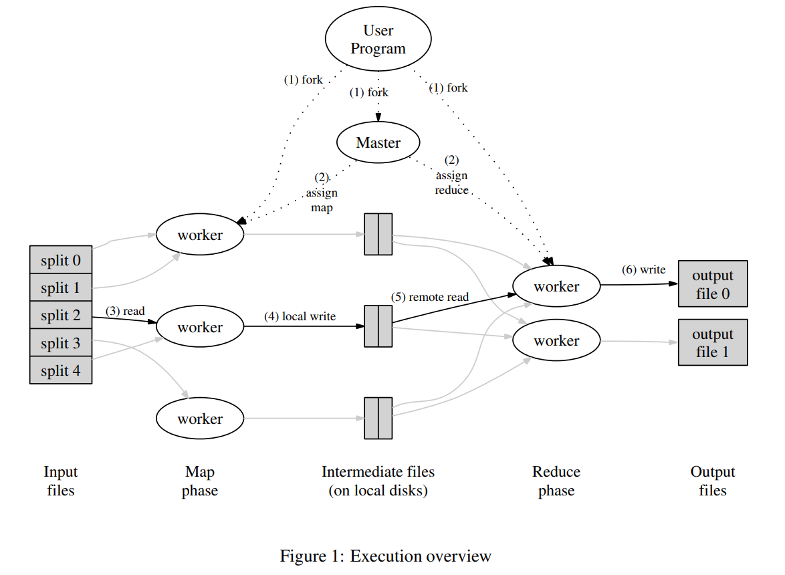

# MapReduce论文阅读记录
MapReduce Paper链接：https://static.googleusercontent.com/media/research.google.com/zh-CN//archive/mapreduce-osdi04.pdf

## MapReduce执行流程
MapReduce执行流程概览图如下所示：

主要流程为：
1. 首先，用户程序中的MapReduce库会把输入文件分片，每一片的大小在16-64MB之间，总共分为M片。之后会在一个机器的多个集群中启动程序。
2. 在所有启动的程序中，有一个是比较特殊的，我们称之为master，其他的称为worker，master会给worker分配任务让其进行执行。总共有M个map任务和R个reduce任务，master会选择一个空闲的worker并为其分配一个map或者reduce任务。
3. 分配了map任务的worker会去读取对应文件分片的内容，它会从输入数据中解析中key/value对并传递给用户自定义的Map函数。由Map函数生成的中间结果key/value对会缓存在内存中。
4. 内存中缓存的key/value对会被定期写入本地磁盘，并且在写入时会根据partition方法分区。本地磁盘上这些文件的位置会传递给master，master记录这些信息，并且把这些信息传递给reduce worker。
5. 当一个执行reduce任务的worker收到master的通知，获取到这些文件的位置以后，它会利用RPC调用来从map worker所在机器的磁盘上读取数据。当一个reduce worker读取到所有中间结果以后，它会根据中间结果的key对中间结果排序，从而使得具有相同key的key/value对被放在一起。
6. reduce worker会遍历排序后的中间结果，对于每一个unique的key，它会把这个key和对应的valus传递给用户自定义的Reduce函数。Reduce函数的输出会被放在一个最终的文件中。
7. 当所有的map任务和reduce任务都结束以后，master会唤醒用户程序。用户程序的MapReduce调用返回结果。

值得注意的是，如果用户定义了分区数量是R，那么就会有R个reduce任务，每个reduce任务生成一个文件，最终会有R个文件生成。

## master数据结构
master需要保存一些数据。

对于每个map任务和reduce任务，master需要保存任务状态（空闲、进行中、已完成等）和worker机器的身份。

map任务生成的中间结果的位置和大小信息，通过master传递给reduce任务。因此，当map任务完成时，会把这些信息发送给master，由master记录。

## 容错
### worker容错
1. master定期ping每一个worker，如果在规定时间内没有收到worker的响应，则认为该worker已经失效。
2. 任何失效worker处理的map任务（包括状态是completed的任务）都需要由master重新分配并由正常工作的worker重新执行，这是因为map任务输出的中间结果保存在worker机器本地磁盘，无法再访问。
3. 如果是reduce任务，当worker出错时只有正在处理中的任务需要被重新分配执行，completed状态的任务无需再次处理，这是因为reduce任务的输出是保存在一个全局的文件系统的，可以被访问到。
4. 如果一个任务最开始在worker A上执行，后续由于worker A出错，该任务又被重新分配到worker B上执行，那么该任务的重新执行应该通知所有执行reduce任务的worker，因为任何一个还没有从worker A读取数据的reduce worker都需要从worker B读取数据。
### master容错
1. 正常来说，master应该定期写checkpoint，如果master挂掉，那么可以根据最新的checkpoint重新启动master。
2. 然而，由于MapReduce的设计中master只有一个master，因此它不太可能挂掉。我们当前的实现中，如果master挂掉，那么就让整个MapReduce计算失败。客户端需要进行check，如果需要的话，重新执行MapReduce计算。

### 出现故障时的语义
1. 每一个运行中的task会将输出写到中间文件中。一个reduce task会输出一个中间文件，而一个map task会输出R个中间文件。
2. 当一个map任务完成时，worker会发送一个消息到master，这个消息包括R个中间文件的名字。
3. 如果master收到了一个已完成的map任务的该消息，就忽略这条消息。否则，它会把这R个文件的信息记录到自己的数据结构中。
4. 当一个reduce任务结束时，reduce worker会原子地将中间文件名修改为最终的输出文件。如果同一个reduce任务在多个机器上执行，那么rename会被call多次。我们依赖底层文件系统的rename操作来保证最终的文件状态只包含一次reduce任务执行的结果。

## 本地化
1. 网络带宽是计算环境中相对稀缺的资源。
2. MapReduce的底层存储是GFS，GFS会把文件分割成64MB的block，并且每个block都存放在多个物理机上。MapReduce的master节点在分配map任务的时候，会将输入文件的存储位置考虑在内，尝试把map任务分配到拥有相关输入文件副本的机器上。如果上述尝试失败的话，master会尝试将map任务分配到一个与拥有输入文件副本机器相近的机器上。
3. 这么做的目的是让map任务在执行时，能够从本地的磁盘中读取大多数的数据文件，节省网络带宽。

## 任务粒度
1. 我们把map阶段分为M个任务，reduce阶段分为R个任务。理想情况下，M和R应当比worker机器的数量大得多。
2. 通常的做法是，M=200000，R=5000，worker机器数量为2000

## 备用任务
一个导致MapReduce任务执行时间过长的原因是系统中存在一些拖后腿的机器，在执行MapReduce计算时，这些机器的执行速度很慢，最后几个任务分配给这些机器时，它们会执行很长的时间。为了解决这个问题，我们可以实现一种机制：当一个MapReduce计算接近完成的时候，master会把当前正在执行的任务重新分配到其他worker机器执行，相当于backup execution。只要有任意一台机器执行完任务，该任务就可以标记为已完成。
